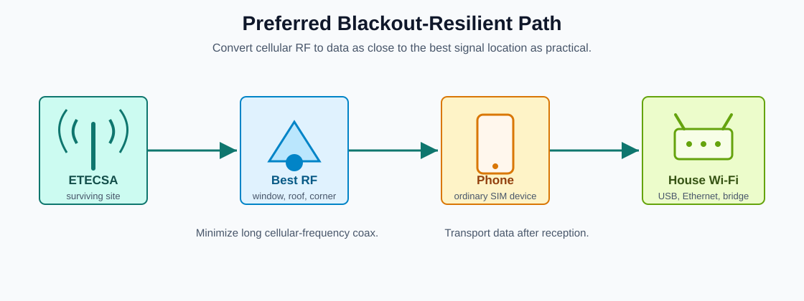

# ETECSA RF Lab

<span class="status-badge status-concept">Research baseline</span>
<span class="status-badge status-warning">No approved antenna blueprint yet</span>
<span class="status-badge status-stop">No active cellular repeater designs</span>

ETECSA RF Lab is a practical engineering project for low-cost, blackout-resilient communication on ETECSA/Cubacel service in Cuba, especially for a target installation in Matanzas.

The project focuses on ordinary phones, passive antennas, passive phone couplers, safe field testing, and data transport by USB, Ethernet, or Wi-Fi after cellular reception.

{ .site-diagram }

## What This Project Is

This project is a public engineering notebook and manual for:

- documenting the communication problem during long blackouts
- testing which ETECSA bands and locations actually work
- comparing passive antenna and coupler ideas
- building standard operating procedures for safe field work
- creating public blueprints only after calculation, simulation, and review
- helping collaborators continue without relying on chat memory

## What This Project Is Not

This project does not design or recommend:

- active cellular RF repeaters
- cellular power amplifiers
- jammers
- IMSI catchers
- base station emulators
- unauthorized transmitters
- systems intended to bypass ETECSA controls

## The Two Engineering Tracks

### Track A: Phone First

Put an ordinary ETECSA-compatible phone where the signal is best, then move data into the house.

```text
ETECSA network
-> phone at best RF location
-> USB, Wi-Fi, or Ethernet
-> router or access point
-> house Wi-Fi
```

### Track B: Improved Passive System

Study and improve a local passive concept:

```text
directional antenna
-> coax
-> passive phone coupler
-> ordinary phone
```

This track is useful only if measurement proves the passive coupler and antenna system gives repeatable benefit.

## Start Here

<div class="grid cards" markdown>

-   **Keep It Simple**

    Plain-language bilingual build paths: what to use, how to assemble it, and what is not approved yet.

    [Open Keep It Simple](keep-it-simple.md)

-   **Field SOPs**

    Use the blackout, antenna, phone coupler, and NanoVNA test procedures before collecting results.

    [Open SOPs](sops.md)

-   **Blueprint Status**

    Understand the difference between concepts, prototypes, field-tested designs, and approved blueprints.

    [Open Blueprints](blueprints.md)

-   **Research Baseline**

    Track ETECSA bands, blackout behavior, coax loss, passive coupling, and import rules.

    [Open Research](research.md)

-   **Collaborate**

    Learn how contributors and AI agents should update the repository without losing context.

    [Open Collaboration](collaboration.md)

</div>

## Current Public Status

- Version: 0.1.0 research baseline
- No field-validated antenna design exists yet.
- No approved blueprint exists yet.
- The first priority is source verification and field measurement.

The recommended next engineering task is to verify current ETECSA band sources, then collect first field measurements using the blackout measurement CSV template.
