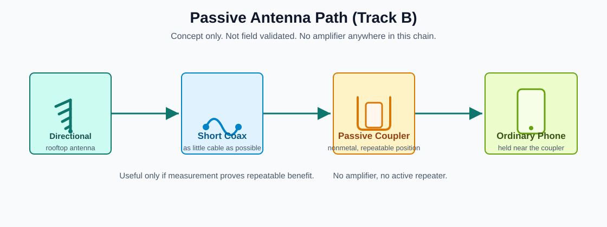

# Path B: Passive Antenna / Camino B: Antena Pasiva

<span class="status-badge status-concept">Concept only</span>
<span class="status-badge status-warning">Not field validated</span>
<span class="status-badge status-stop">No amplifier</span>

{ .site-diagram }

## Simple Blueprint / Plano Simple

=== "English"

    This is the passive path to investigate:

    ```text
    outside directional antenna
    -> short coax cable
    -> passive phone coupler
    -> ordinary phone held in a repeatable position
    ```

=== "Español"

    Este es el camino pasivo que se va a investigar:

    ```text
    antena direccional exterior
    -> cable coaxial corto
    -> acoplador pasivo para teléfono
    -> teléfono normal puesto en una posición repetible
    ```

## Current Status / Estado Actual

=== "English"

    No final dimensions are approved yet.

    The first simple goal is not to build the perfect antenna. The first goal is to learn whether a passive antenna and coupler really help the phone in a repeatable way.

=== "Español"

    Todavía no hay dimensiones finales aprobadas.

    La primera meta simple no es construir la antena perfecta. La primera meta es saber si una antena pasiva y un acoplador realmente ayudan al teléfono de forma repetible.

## Materials / Materiales

=== "English"

    Possible simple materials:

    - aluminum rod or tube for antenna elements
    - copper wire if aluminum is not available
    - short coax cable
    - RF connectors that match the coax
    - plastic, PVC, or wood for nonmetal support
    - screws and simple fasteners
    - weatherproof tape or sealant
    - plastic box or shield for rain protection
    - nonmetal phone holder
    - ruler or measuring tape
    - compass or phone compass app

=== "Español"

    Materiales simples posibles:

    - varilla o tubo de aluminio para los elementos de antena
    - alambre de cobre si no hay aluminio
    - cable coaxial corto
    - conectores RF que sirvan con el coaxial
    - plástico, PVC, o madera para soporte no metálico
    - tornillos y sujetadores simples
    - cinta o sellador para proteger de lluvia
    - caja plástica o protección contra lluvia
    - soporte no metálico para el teléfono
    - regla o cinta de medir
    - brújula o aplicación de brújula en el teléfono

## Building Instructions / Instrucciones De Construcción

=== "English"

    Use these steps only for experiments until a real blueprint is approved:

    1. Choose a safe outdoor place with better signal.
    2. Keep the coax cable as short as possible.
    3. Put the phone coupler close to the phone, but do not glue it permanently.
    4. Make the phone holder adjustable.
    5. Test different phone positions.
    6. Test different phone distances from the coupler.
    7. Point the antenna slowly in different directions.
    8. Record the best direction and phone position.
    9. Compare with the phone alone in the same place.

=== "Español"

    Usa estos pasos solo para experimentos hasta que exista un plano real aprobado:

    1. Escoge un lugar exterior seguro con mejor señal.
    2. Mantén el cable coaxial lo más corto posible.
    3. Pon el acoplador cerca del teléfono, pero no lo pegues de forma permanente.
    4. Haz que el soporte del teléfono sea ajustable.
    5. Prueba varias posiciones del teléfono.
    6. Prueba varias distancias entre el teléfono y el acoplador.
    7. Gira la antena lentamente en diferentes direcciones.
    8. Anota la mejor dirección y posición del teléfono.
    9. Compara con el teléfono solo en el mismo lugar.

## Simple Test / Prueba Simple

=== "English"

    For each antenna direction and phone position, record:

    - place
    - antenna direction
    - phone position
    - distance from phone to coupler
    - network type: 2G, 3G, or 4G
    - band if visible
    - signal level if visible
    - WhatsApp text: yes or no
    - WhatsApp call: yes or no
    - IMO call: yes or no
    - notes

=== "Español"

    Para cada dirección de antena y posición del teléfono, anota:

    - lugar
    - dirección de la antena
    - posición del teléfono
    - distancia entre teléfono y acoplador
    - tipo de red: 2G, 3G, o 4G
    - banda si se ve
    - nivel de señal si se ve
    - texto por WhatsApp: sí o no
    - llamada por WhatsApp: sí o no
    - llamada por IMO: sí o no
    - notas

## Do Not Use / No Usar

=== "English"

    - active cellular repeater
    - cellular amplifier
    - booster
    - high-power transmitter
    - hidden or unknown RF electronics
    - metal phone holder touching the phone antenna area

=== "Español"

    - repetidor celular activo
    - amplificador celular
    - booster
    - transmisor de alta potencia
    - electrónica RF oculta o desconocida
    - soporte metálico tocando el área de antena del teléfono

